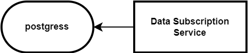

# Data Subscription API - Data Subscription Service

[](https://bdcfs.jaas-gcp.cloud.sap.corp/job/fos/job/microservices/job/fos-data-subscription-svc/job/main/)
[](https://sonar.tools.sap/dashboard?id=bdc-fos-data-subscription-service)
[](https://sonar.tools.sap/dashboard?id=bdc-fos-data-subscription-service)

[Dev Config](https://github.tools.sap/bdc-fos/fos-data-subscription-dev-config) |
[Prod Config](https://github.tools.sap/bdc-fos/fos-data-subscription-prod-config) |
[ArgoCD](https://b46998abac334a.sister.argocdaas.shoot.live.k8s-hana.ondemand.com/applications/fos-data-subscription-eu10-dev-app?orphaned=false&resource=) |
[Repos.xml](https://github.wdf.sap.corp/final-assembly/organizations/blob/master/github.tools.sap/repos.xml) |
[CheckMarx](https://checkmarx.tools.sap/projects/7f563595-6a04-41f4-9c21-70f01606977c/overview?branch=main) |
[Mend](https://sap.whitesourcesoftware.com/Wss/WSS.html#!project;id=7049622) |
[PPMS](https://i7p.wdf.sap.corp/ppmslight/index.html#/details/cv/73554900100200024647/overview) |
[Sirius](https://sirius.tools.sap.corp/sirius/#/program/0A5E2C6685E2014A01B8F3EA8467D30A/delivery/41CC72905367BA4A473A82EAABB92081/pipeline-dashboard) |
[Black Duck - Protecode](https://bdba.tools.sap/#/components/) |
[Black Duck Binary Analysis](https://bdba.tools.sap/#/groups/2928/applications?search=notifi&offset=0) |
[Software Vulnerability Monitor](https://svmprod-zdohvhnx0v.dispatcher.int.sap.eu2.hana.ondemand.com/webapp/index.html#/ProtecodeSelfServiceEntry) |
[Dynatrace Dashboard ENG](https://live.eu10.apm.services.cloud.sap/e/9a15c1d7-3d81-4941-b719-92dbb998d93f/#dashboard;id=f3b307f1-a599-4c66-9432-9d03560b6ecc;applyDashboardDefaults=true) |
[Dynatrace Dashboard PROD](https://live.eu10.apm.services.cloud.sap/e/4354de1b-45c1-4b74-95ef-3a35ab3b5a5c/#dashboard;id=bdda65ff-8d34-4d9d-9fa7-1826f7d81ed2;applyDashboardDefaults=true) |
[CLS Dashboard ENG](https://dashboards-sf-3170beae-f983-41a6-845d-29f1ae1e5a93.cls-14.cloud.logs.services.eu10.hana.ondemand.com/app/dashboards#/view/dss-dashboard) |
[CLS Dashboard PROD](https://dashboards-sf-bd914071-fd5d-4769-948f-840818223984.cls-14.cloud.logs.services.eu10.hana.ondemand.com/app/dashboards#/view/dss-dashboard)

Data Subscription API Support:
- Teams channel [BDC FOS DS API for Producers ](https://teams.microsoft.com/l/team/19%3AlvxzAq-QzuH0yDl_yVOlqlnUyeJbMnr-NTvK-1IpzR01%40thread.tacv2/conversations?groupId=d3c4d302-4a4a-4574-8c14-b60ad638f541&tenantId=42f7676c-f455-423c-82f6-dc2d99791af7)
- Slack [#lighthugger-dsapi-support](https://sap.enterprise.slack.com/archives/C07RC09FNRW)

Data Subscription Services (DSAPI) implement [Data Subscription API](https://pages.github.tools.sap/CPA/data-product-howto-guide/enabling-lob/data-acquisition/data-subscription-api) based data ingestion channel that data producers can adopt for delivering data into the BDC Foundation Services data platform.

This repo contains sample Kyma/Node.js implementation of Producer's side Data Subscription service, intended as boilerplate implementation for Producers and used as a mock service for BDC FOS integration test purposes.

## Data Subscription API Specification
[Data Subscription API (producer)](https://pages.github.tools.sap/bdc-fos/fos-data-subscription-svc/docs/api/data-subscription-api/swagger.html)

## Data Subscription Service
Data Subscription Service is hosted by Producers. Implementation in this repo serves a) as an **example** API implementation with limited functionality and b) as a **mock service** representing Producer for integration test purposes.

Based on entities defined in data product definition, Subscriber creates subscriptions via Producer's Data Subscription Service, to ask for data feed of a particular source-tenant and entity. Based on the subscription, Producer regularly sends sets of events (TG27) signifying changes in the Producer's source database to the Subscriber's Object Store and notifies Subscriber of the delivery. Optionally, Producer exposes list of sent notifications corresponding to a particular subscription.

A most common use-case is the regular subscription, defined by a cron schedule. The schedule is defined as "best effort", not a strict contract requiring exact timing. Only a single regular subscription can exist for a given source+subscriber+entity combination.

The subscription can be updated, to allow Subscriber to request resending of data from a particular point in time. This is intended for both DevOps and automated functionality. For example, after a disaster recovery, tenant's HDL is restored from a week old backup - Subscriber would then patch the subscription to lower the upper-watermark by one week. Another use case is the Schema Evolution, when Producer indicates that a new schema requires refill of historical data due to new column introduced. When upper-watermark is modified (subscription patched), Producer is expected to send the next batch of data from the point in time defined by the new upper-watermark.

**Resource managed by this service:** Subscription record per **source-tenant** per **entity** per **subscriber**

**Scaling:**
- subscription will be created per source app tenant per each entity per subscriber only once at tenant onboarding (predictable)
- subscription will be updated when schedule or upper watermark needs to be changed (unpredictable but not frequent)
- subscription will be deleted (unpredictable but not frequent)

### Responsibilities
- [x] handle lifecycle of the subscription resource: POST, PATCH, DELETE, GET resource by id, GET resource collection (HATEOAS HAL format links in response._links)
- [x] support synchronous operation only (no heavy processing is expected)
- [x] validate POST operation body using json-schema
- [x] support health endpoint
- [x] support autoscaling (default setup for all landscapes: min 1, max 8 instances, [scaling rules](./cf-deploy))
- [x] expose list of subscription resources with filter on **subscriber** and **source**
- [x] allow resending of data via PATCH operation of **upper-watermark**
- [x] allow change in cadence of data delivery via PATCH operation of **schedule**
- [x] allow interruption of data delivery via DELETE operation
- [x] only allow single scheduled subscription for a particular source+subscriber+entity combination

### GUI to access files stored in HDL
In order to browse files and folders stored in HDL using client with graphical interface, connect to HDL container via HANA Database Explorer.

1. Open HANA Database Explorer - can be opened from multiple locations:
    - From SAP HANA Cloud Central on either a SAP HANA or SAP data lake instance
    - From the SAP HANA cockpit
    - From the SAP Business Technology Platform (SAP BTP) Cockpit from an SAP HANA or Data Lake instance when the instances are deployed into a Cloud Foundry space.
    - From the Business Application Studio in a SAP HANA Native Application development space
    - From the SAP Web IDE for SAP HANA with the extension enabled

    More detailed info about SAP HANA Database explorer can be found on [hana dbx overview page](https://developers.sap.com/tutorials/hana-dbx-overview.html)
    - use existing BTP account and choose applications, only then the menu SAP HANA Cloud will appear
    - after login you might get database error, but it doesn't matter for HDL to browse, because you will add yours in bellow steps
2. Add HDL instance by clicking `Add Instance (+)` button. Select type `Data Lake Files`.
3. Fill in connection details. For testing and exploration purposes [testing cert/key TBD]() pair can be used.
    - Rest API Endpoint: `cfb06991-66a7-4138-bf57-a9e3bf308e83.files.hdl.prod-us30.hanacloud.ondemand.com`
    - Client Cert: `cert-ok.pem` - take only first one from cert chain (one with Locality=Homeoffice)
    - Client key: `key-ok.pem` - convert it to pkcs8 format by `openssl pkcs8 -topk8 -nocrypt -in key-ok.pem`

Managing and viewing files stored in HDL is also possible via:
- [REST API](https://help.sap.com/doc/9d084a41830f46d6904fd4c23cd4bbfa/2022_4_QRC/en-US/html/index.html)
- [HDLFSCLI](https://developers.sap.com/tutorials/data-lake-file-containers-hdlfscli.html) - commandline interface

## Ring Deployment Tests
See documentation [here](ring-deployment-tests/README.md)

## Liquibase
See documentation [here](liquibase/README.md)

## Audit logging

Audit Log manager *Role Collection*, resp. **auditlog-viewer!** and **auditlog-management!** roles are required to view
logs in the **Audit Log Viewer**.

### What is logged

We are logging only configuration changes of following resources:

 * _dataSubscriptions_
   * configuration changes of  resource
     * WRITE, DELETE, PATCH
   * Error events

#### Example

Log message:

> Configuration modification message.<br/>
> Attribute with name **"active"** and value `"false"` was added.<br/>
> Attribute with name **"upperWatermark"** and value `"1970-01-01T01:00:00.000Z"` was added.<br/>
> Attribute with name **"schedule"** and value `"***4*"` was added.<br/>
> The attributes are a part of an object with type "dsapiSubscription.dataSubscriptions" and
> id consisting of: state "SUCCESS", operation "UPDATE", namespace "dsapiSubscription.dataSubscriptions", id "7b74501b-a94c-41f3-91d2-7cc0ba257bc6".

```json
{
  "message_uuid": "64D0F764E9F608CB495BF8F8729F70FB",
  "time": "2025-01-23T08:24:37.282Z",
  "tenant": "0950e3d7-1ed6-4adc-bc87-d58914cb753a",
  "org_id": "-",
  "space_id": "undefined",
  "app_or_service_id": "",
  "als_service_id": "37c22d29-91ed-4133-817f-24376350058c",
  "user": "bdc-fos test-certificate",
  "category": "audit.configuration",
  "format_version": "",
  "message": {
    "uuid": "64D0F764E9F608CB495BF8F8729F70FB",
    "user": "bdc-fos test-certificate",
    "time": "2025-01-23T08:24:37.282Z",
    "id": "3c9a921e-ebe8-4fb4-bbf2-1028d83329e6",
    "success": true,
    "object": {
      "type": "dsapiSubscription.dataSubscriptions",
      "id": {
        "state": "SUCCESS",
        "operation": "UPDATE",
        "namespace": "dsapiSubscription.dataSubscriptions",
        "id": "7b74501b-a94c-41f3-91d2-7cc0ba257bc6"
      }
    },
    "attributes": [
      {
        "name": "active",
        "new": "false"
      },
      {
        "name": "upperWatermark",
        "new": "1970-01-01T01:00:00.000Z"
      },
      {
        "name": "schedule",
        "new": "***4*"
      }
    ],
    "category": "audit.configuration",
    "tenant": "0950e3d7-1ed6-4adc-bc87-d58914cb753a",
    "customDetails": {}
  }
}
```

### Links:

|   Service    | Link                                                                                                          |
|:------------:|---------------------------------------------------------------------------------------------------------------|
|     POC      | https://eu10-poc-9rh86khp.authentication.eu10.hana.ondemand.com/login                                         |
|     DEV      | https://eu10-dev-l8igdt52.auditlog-viewer.cfapps.eu10.hana.ondemand.com/index.html                            |
|      QA      | https://eu10-qa-yl0p6tem.auditlog-viewer.cfapps.eu10.hana.ondemand.com/index.html                             |
|  DEV-CANARY  | https://6c187c81-a5c4-42f0-8879-63cb4cae5220-7322a123.auditlog-viewer.cfapps.sap.hana.ondemand.com/index.html |
|    STAGE     | https://eu10-stage-2oxeiujj.auditlog-viewer.cfapps.eu10.hana.ondemand.com/index.html                          |
| STAGE-CANARY | https://eu10-stage-canary-vls2oi4c.auditlog-viewer.cfapps.sap.hana.ondemand.com/index.html                    |

### Dependency map:



